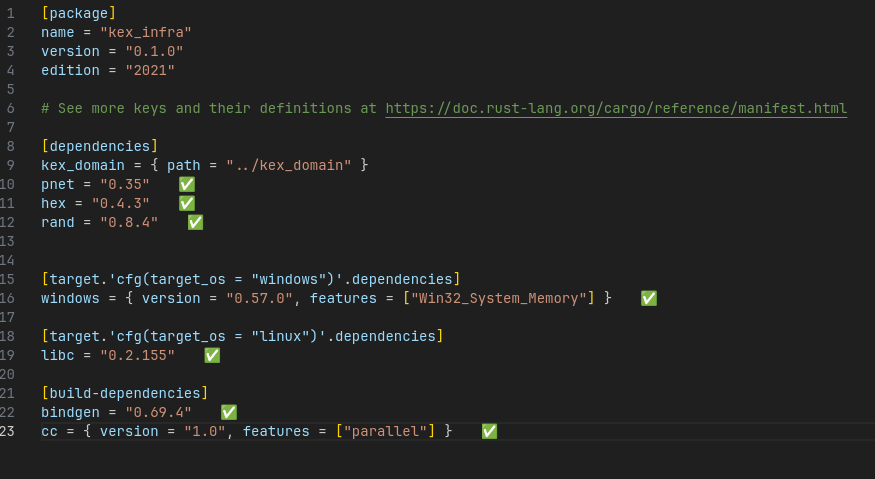
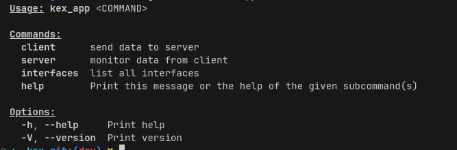
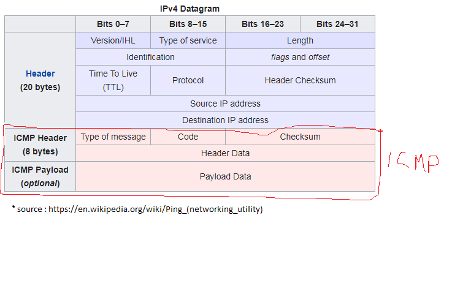
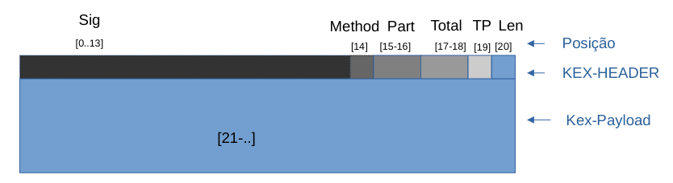
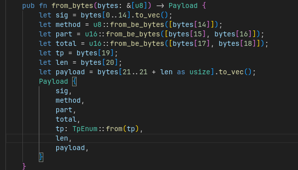
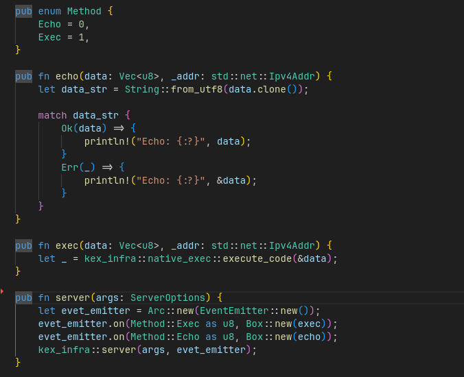

# kex
## RPC (Remote procedure call) - Exfiltration/Backdoor

Este projeto é uma implementação de um sistema de RPC que pode ser usado para exfiltração e/ou backdoor. Ele utiliza o protocolo ICMP para a transmissão e recepção de Kex-Payloads e o padrão Observable (EventEmitter) para a gestão de eventos.

## Dependências

O projeto depende dos seguintes pacotes:

## Como usar

Para usar este projeto, você precisará instalar as dependências listadas acima. Uma vez instaladas, você pode executar o projeto a partir da linha de comando.
passando a "interface net" e uma assinatura de 14 bytes para que o pacote icmp seja reconhecido como um comando ex:

## Proximos passos
- Criação de tutoriais

## Intro:

### A primeira parte, é entender o pacote ICMP:

O Protocolo de Mensagens de Controle da Internet (ICMP) é usado principalmente para diagnosticar problemas de rede. Ele opera na camada de rede do modelo OSI, permitindo que os dispositivos de rede enviem mensagens de erro ou de controle indicando, por exemplo, que um serviço ou host específico não está alcançável. Uma das utilizações mais conhecidas do ICMP é o comando `ping`, que verifica a conectividade entre dois hosts na rede. O ICMP pode informar sobre rotas inalcançáveis, redirecionar rotas, e ajudar na gestão e no controle de fluxo de dados na internet.

O ICMP no contexto desta ferramenta é usado para transportar um payload customizado para ser interpretado pelo "Kex" no modo "server", o Kex monitorando os pacotes ICMP fica aguardando dados que contenha uma assinatura pre-determinada de 14 bytes, e que seja valido no seguinte formato em bytes:

### Sig:
É o campo que difere um payload comum ou payload de outra instancia do kex.

### Method:
É o campo que define qual será a função responsavel por ler e/ou executar o payload
atualmente duas funções padrões estão implementadas, Echo e Exec. A função echo é um "hello world" do RPC (Remote procedure call) e Exec, que aloca uma area de memoria executavel que armazena o kex-Payload para execução imediata. 

### Part e Total:
São os campos utilizados para identificar a fragmentação dos dados em diferentes payloads icmp.
Caso não tenha fragmentação o valor padrão é de:   ``Part=Total=0x01``

### TP:
Identifica qual o tipo de execução que será executada Request ou Response, Inspirado no HTTP. 

### Len:
É o tamanho do payload, esse campo é importante para calcular a extração de dados uteis, já que para uma evação podes querer enviar dados "lixos" juntamente ao payload útil.

## Contribuindo

Contribuições para este projeto são bem-vindas. Por favor, abra um problema ou uma solicitação de pull request para contribuir.

## Licença

Este projeto está licenciado sob os termos da licença MIT.
